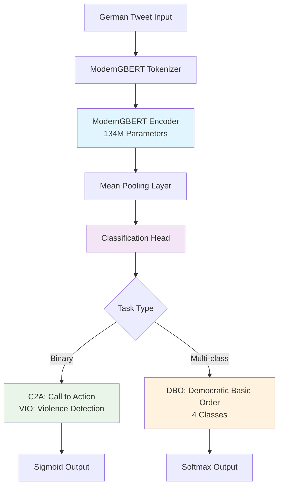
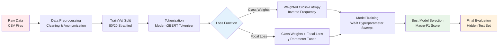

# GermEval 2025: Fine-tuning ModernGBERT for Harmful Content Detection

[](https://arxiv.org/abs/[SUBMISSION_PAPER_LINK])
[](https://huggingface.co/LSX-UniWue/ModernGBERT_134M/blob/main/license.md)
[](https://www.codabench.org/competitions/4963/)

> **abullardUR@GermEval Shared Task 2025**: Fine-tuning ModernGBERT on Highly Imbalanced German Social Media for Harmful Content Detection

This repository contains the code and information for the [GermEval 2025 Shared Task](https://www.codabench.org/competitions/4963/) submission on Harmful Content Detection in German Social Media. The submission focuses on two approaches for handling class imbalance in highly imbalanced datasets through different loss calculation methods.

## 🎯 Task Overview

The submission covers all three subtasks in the GermEval 2025 Shared Task:

| Subtask | Task | Type | Description |
|---------|------|------|-------------|
| **C2A** | Call to Action | Binary | Detection of calls for risky actions |
| **DBO** | Attacks on Democratic Basic Order | Multi-class (4) | Classification of statements against democratic principles |
| **VIO** | Violence Detection | Binary | Detection of violence-related content |

## 📊 Results

### Performance Summary (Macro-F1)

| Method | C2A | DBO | VIO |
|--------|-----|-----|-----|
| Baseline (organizers) | 0.59 | 0.47 | 0.69 |
| **ModernGBERT + Class Weights (ours)** | **0.82** | **0.63** | **0.82** |
| **ModernGBERT + Weights + Focal (ours)** | **0.82** | **0.56** | **0.81** |

### Competition Rankings

- **C2A**: 4/9 teams
- **DBO**: 6/9 teams  
- **VIO**: 2/8 teams

### Performance Visualization

#### Model Comparison Chart

## 🚀 Quick Start

### Installation

```bash
pip install transformers torch
```

### Inference Example

```python
from transformers import AutoProcessor, AutoModelForSequenceClassification

# Selects the task: "c2a", "dbo", or "vio"
task = "c2a"
model_id = f"abullard1/germeval2025-{task}-moderngbert-cw"

# Loads the model and processor
proc = AutoProcessor.from_pretrained(model_id, trust_remote_code=True)
mdl = AutoModelForSequenceClassification.from_pretrained(model_id, trust_remote_code=True).eval()

# Runs inference
text = "<your text>"
inputs = proc(text, return_tensors="pt", truncation=True)
probs = mdl(**inputs).logits.softmax(-1).detach().cpu().numpy()
print(probs)
```

## 🤖 Model Zoo

| Task | Class Weights | Class Weights + Focal Loss |
|------|---------------|----------------------------|
| **C2A** | [germeval2025-c2a-moderngbert-cw](https://huggingface.co/abullard1/germeval2025-c2a-moderngbert-cw) | [germeval2025-c2a-moderngbert-cw_and_focal](https://huggingface.co/abullard1/germeval2025-c2a-moderngbert-cw_and_focal) |
| **DBO** | [germeval2025-dbo-moderngbert-cw](https://huggingface.co/abullard1/germeval2025-dbo-moderngbert-cw) | [germeval2025-dbo-moderngbert-cw_and_focal](https://huggingface.co/abullard1/germeval2025-dbo-moderngbert-cw_and_focal) |
| **VIO** | [germeval2025-vio-moderngbert-cw](https://huggingface.co/abullard1/germeval2025-vio-moderngbert-cw) | [germeval2025-vio-moderngbert-cw_and_focal](https://huggingface.co/abullard1/germeval2025-vio-moderngbert-cw_and_focal) |

### 🎮 Interactive Demo
Try out the models in this interactive Huggingface Space:

<div align="center">

**[🔗 Live Demo: GermEval 2025 abullardUR Submission Models](https://huggingface.co/spaces/abullard1/abullardUR_GermEval2025_Submission_ModelZoo)**

*Experience our harmful content detection approach with this interactive demo. Use any of the provided example text snippets or use your own text to see how our models classify it.*

</div>

## 📋 Method

- **Architecture**: One model per subtask with mean-pooling head on ModernGBERT
- **Class Imbalance Handling**: 
  - Inverse-frequency class weights
  - Class weights + focal loss
- **Preprocessing**: Minimal preprocessing; retain anonymization tokens

### System Architecture



### Training Pipeline



## 📁 Dataset

**Source**: GermEval 2025 shared task datasets (tweets from right-wing extremist networks, 2014–2016)

### Class Distribution Analysis

#### Dataset Statistics

| Subtask | Total Samples | Majority Class | Minority Class(es) | Imbalance Ratio |
|---------|---------------|----------------|-------------------|-----------------|
| **C2A** | 6,840 | False: 6,177 (90.3%) | True: 663 (9.7%) | 9.3:1 |
| **DBO** | 7,454 | Nothing: 6,277 (84.2%) | Subversive: 60 (0.8%) | 104.6:1 |
| **VIO** | 7,783 | False: 7,219 (92.8%) | True: 564 (7.2%) | 12.8:1 |

#### Class Imbalance Visualization

<div align="center">

| C2A (Call to Action) | DBO (Democratic Basic Order) | VIO (Violence Detection) |
|:---:|:---:|:---:|
|  |  |  |
| **Binary**: 90.3% / 9.7% | **Multi-class**: 84.2% / 10.8% / 4.2% / 0.8% | **Binary**: 92.8% / 7.2% |

</div>

### Raw Data Files

<details>
<summary>Click to expand raw data structure</summary>

#### C2A (Call to Action)
- [c2a_train.csv](Competition-Solution/data/raw/c2a/c2a_train.csv)
- [c2a_trial.csv](Competition-Solution/data/raw/c2a/c2a_trial.csv)  
- [c2a_test.csv](Competition-Solution/data/raw/c2a/c2a_test.csv)

#### DBO (Democratic Basic Order)
- [dbo_train.csv](Competition-Solution/data/raw/dbo/dbo_train.csv)
- [dbo_trial.csv](Competition-Solution/data/raw/dbo/dbo_trial.csv)
- [dbo_test.csv](Competition-Solution/data/raw/dbo/dbo_test.csv)

#### VIO (Violence)
- [vio_train.csv](Competition-Solution/data/raw/vio/vio_train.csv)
- [vio_trial.csv](Competition-Solution/data/raw/vio/vio_trial.csv)
- [vio_test.csv](Competition-Solution/data/raw/vio/vio_test.csv)

</details>

### Processed Data Structure

- [processed/c2a/](Competition-Solution/data/processed/c2a/)
- [processed/dbo/](Competition-Solution/data/processed/dbo/)  
- [processed/vio/](Competition-Solution/data/processed/vio/)

Each processed dataset contains:
- `{task}_cleaned_trial.csv` - Cleaned trial dataset
- `{task}_cleaned_train.csv` - Cleaned training dataset
- `{task}_hf_dataset/` - Hugging Face dataset artifacts
- `{task}_hf_dataset_train/` - Training split HF dataset
- `{task}_hf_dataset_tokenized/` - Tokenized trial split
- `{task}_hf_dataset_tokenized_train/` - Tokenized training split

> **Note**: Trial splits were divided into train/validation/test based on the trial dataset. Training splits were divided into train/validation/test with the test split being the organizers' hidden test set for final evaluation.

>  The training dataset is also available on Huggingface 🤗 [here](https://huggingface.co/datasets/abullard1/germeval-2025-harmful-content-detection-training-dataset).

## ⚙️ Hyperparameters

### Final Model Configuration

| Subtask | Approach | Learning Rate | Weight Decay | Batch Size (Train/Eval) | Epochs | Warmup | Gamma | W&B Run |
|---------|----------|---------------|--------------|-------------------------|--------|--------|-------|---------|
| **C2A** | CW | 3e-5 | 0.0973 | 8/32 | 8 | 500 | - | [View Run](https://wandb.ai/uni-regensburg/Bachelors-Thesis/runs/f3sj4dsu) |
| **C2A** | FL | 5e-5 | 0.0227 | 16/16 | 5 | 100 | 0.599 | [View Run](https://wandb.ai/uni-regensburg/Bachelors-Thesis/runs/1rmk56s2) |
| **DBO** | CW | 1e-4 | 0.0417 | 8/16 | 5 | 500 | - | [View Run](https://wandb.ai/uni-regensburg/Bachelors-Thesis/runs/baojeybb) |
| **DBO** | FL | 3e-5 | 0.0270 | 16/16 | 8 | 100 | 1.537 | [View Run](https://wandb.ai/uni-regensburg/Bachelors-Thesis/runs/jztf6qdn) |
| **VIO** | CW | 5e-5 | 0.0301 | 16/32 | 3 | 300 | - | [View Run](https://wandb.ai/uni-regensburg/Bachelors-Thesis/runs/5nxgj5cu) |
| **VIO** | FL | 3e-5 | 0.0811 | 16/32 | 3 | 100 | 0.519 | [View Run](https://wandb.ai/uni-regensburg/Bachelors-Thesis/runs/atwbs5si) |


### Hyperparameter Optimization

All hyperparameters were optimized using Weights & Biases Bayesian sweeps:

| Subtask | Class-Weighted (CW) | Focal Loss (FL) |
|---------|-------------------|-----------------|
| **C2A** | [View Sweep](https://wandb.ai/uni-regensburg/Bachelors-Thesis/sweeps/x4cxix6l) | [View Sweep](https://wandb.ai/uni-regensburg/Bachelors-Thesis/sweeps/y6n4824y) |
| **DBO** | [View Sweep](https://wandb.ai/uni-regensburg/Bachelors-Thesis/sweeps/jeb5ysrp) | [View Sweep](https://wandb.ai/uni-regensburg/Bachelors-Thesis/sweeps/tttb1wf3) |
| **VIO** | [View Sweep](https://wandb.ai/uni-regensburg/Bachelors-Thesis/sweeps/5548o60h) | [View Sweep](https://wandb.ai/uni-regensburg/Bachelors-Thesis/sweeps/1adpvole) |

## 📁 Repository Structure

```
.
└── README.md           # this file
```

## 📄 Documentation

- [System Paper](System-Paper/abullardUR@GermEval-Shared-Task-2025.pdf)
- [Organizers' Overview Paper](https://www.aclweb.org/anthology/2025.germeval-1.1/)
- [ModernGBERT Paper](https://arxiv.org/abs/2505.13136) - Base model architecture and training details

## 📜 License

- **Code**: MIT
- **Model**: ModernGBERT base model: [Research-only RAIL-M license](https://huggingface.co/LSX-UniWue/ModernGBERT_134M/blob/main/license.md)
- **Fine-tuned models**: Inherit ModernGBERT's research-only license
- **Dataset**: [GPL-3.0](https://www.gnu.org/licenses/gpl-3.0.html). Follow the license terms when using or redistributing the data.

## 📖 Citation (Preliminary)

```bibtex
@inproceedings{bullard2025germeval,
  title   = {abullardUR@GermEval Shared Task 2025: Fine-tuning ModernGBERT on Highly Imbalanced German Social Media for Harmful Content Detection},
  author  = {Bullard, Samuel},
  year    = {2025},
  booktitle = {Proceedings of KONVENS 2025 Workshops}
}
```

## 🙏 Acknowledgments

- Organizers of the GermEval 2025 shared task
- Prof. Dr. Udo Kruschwitz for supervision and guidance

---

<div align="center">

**[📊 Results](#-results) • [🚀 Quick Start](#-quick-start) • [🤖 Models](#-model-zoo) • [📁 Data](#-dataset) • [⚙️ Config](#️-hyperparameters)**

</div>
